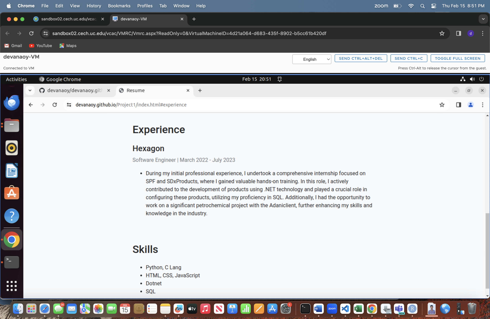
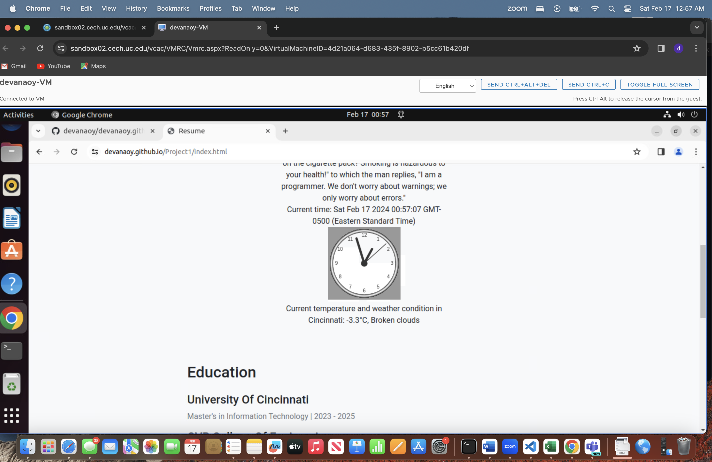

# WAPH-Web Application Programming and Hacking

## Instructor: Dr. Phu Phung

  Student

 **Name**: Omprakashreddy Devanampalli

**Email**: devanaoy@ucmail.uc.edu


**Short-bio**: Omprakashreddy Devanampalli has keen interest in ethical hacking and secure software development. 

## Repository Information

Respository's URL: [git@github.com:devanaoy/waph-devanaoy.git](git@github.com:devanaoy/waph-devanaoy.git)

This is a private repository for Omprakashreddy Devanampalli to store all code from the course. The organization of this repository is as follows.

# Individual Project 1 – Front-end Web Development with a Professional Profile Website on github.io cloud service

## Overview and Requirements 

For my Individual Project 1, I crafted a professional website hosted on GitHub Pages, serving as a dynamic portfolio showcasing my resume, skills, and experiences. This project aimed to elevate my proficiency in front-end web development, and it involved implementing various technical features like integrating a joke API, digital clock, analog clock, displaying email, weather API, and a Flag counter. The deployment on GitHub Pages provided practical insights into the process of making web content publicly accessible.

The link to access my website is: [https://devanaoy.github.io/Project1/index.html](https://devanaoy.github.io/Project1/index.html)

The link to access Individual Project-1 is: [https://github.com/devanaoy/devanaoy.github.io](https://github.com/devanaoy/devanaoy.github.io)

## General Requirements

### Personal Website on Github.io

I established a fresh public repository titled devanaoy.github.io and designed a personal website using GitHub Pages. The website encompasses details about my resume, contact information, education, experiences, projects, certifications, and skills.

The link to access my website is: [https://devanaoy.github.io/Project1/index.html](https://devanaoy.github.io/Project1/index.html)





### "Web Application Programming and Hacking" course and related hands-on projects on waph.html file

I generated a dedicated page named "waph.html" within my repository, providing an introduction to the "Web Application Programming and Hacking" course and its associated practical projects. The page includes summaries of Lab0, Lab1, Lab2, Hackathon 1, and Individual Project 1, presenting the key aspects of each in unique terms.

The link to access waph.html is: [https://devanaoy.github.io/Project1/waph.html](https://devanaoy.github.io/Project1/waph.html)

This page link is accessible from the personal website as shown in below screenshot:


## Non-technical requirements

### Bootstrap Template

I have downloaded a bootstrap template from the website `https://bootstrapmade.com/` 

I changed the template as per my requirements and tasks given by the professor

### Page Tracker

I Integrated Flag Counter as a page tracker to monitor website visits and engagement. 

I opted for the website https://flagcounter.com/ among the two provided options. I acquired a key from the site and incorporated it into my code. The flag counter is now displayed on the homepage of my website through integration.

Code for integrating Flag Counter:

```html
<div style="text-align:left;">
    <a href="https://info.flagcounter.com/szVl"></a>
</div>
```


## Technical requirements

### A digital clock; An analog clock

This HTML and JavaScript code snippet provides several functionalities on a webpage. 

The first section displays a digital clock by updating the content of a `<div>` element with the id "digit-clock" every 500 milliseconds. The time is retrieved using `new Date()`.

The second section showcases an analog clock using the HTML5 `<canvas>` element. The clock is drawn by utilizing the provided external JavaScript file "clock.js." This script defines functions to draw the clock face, numbers, and time. The `setInterval` function ensures that the clock is updated every second.

The third section involves a simple mechanism to show/hide an email address on the webpage. Initially, the paragraph with the id "email" displays "Show my email." Clicking on it toggles between displaying the email address "devanaoy@ucmail.uc.edu" as a hyperlink and reverting to the initial "Show my email" message.

Together, these snippets enhance the webpage with a digital clock, analog clock, and a toggleable email address for user interaction.

Source Code for digital clock:
```JS
<div id="digit-clock"></div>
    <script>
    function displayTime() {
        document.getElementById('digit-clock').innerHTML = "Current time: " + new Date();
    }
    setInterval(displayTime, 500);
    </script>
```

Source Code for Analog clock:
```JS
</div>
    <canvas id="analog-clock" width="150" height="150" style="background-color:#999"></canvas>
    <script src="https://waph-uc.github.io/clock.js"></script>
    <script>
        var canvas = document.getElementById("analog-clock");

        var ctx = canvas.getContext("2d");

        var radius = canvas.height / 2;

        ctx.translate(radius, radius);
        radius = radius * 0.9;

        setInterval(drawClock, 1000);
        function drawClock() {
            drawFace(ctx, radius);

            drawNumbers(ctx, radius);

            drawTime(ctx, radius);
        }
            </script>
```


Source Code for show/hide your email:

```JS
<p id="email" onclick="showhideEmail()">Show my email</p>
     <script>
        var shown = false;

        function showhideEmail() {
            if (shown) {
                document.getElementById("email").innerHTML = "Show my email";
                shown = false;
            } else {
                var myemail =
                    "<a href='mailto:devanaoy" +
                    "@" +
                    "ucmail.uc.edu'>devanaoy" +
                    "@" +
                    "ucmail.uc.edu</a>";
                document.getElementById("email").innerHTML = myemail;
                shown = true;
            }
        }
    </script>
```

Screenshot Showing Show/hide your email:


### One more Functionality of my choice

The provided code snippet demonstrates a simple interactive button implemented using jQuery. Upon clicking the button with the id "interactive-button," an alert message saying 'Button clicked!' will be triggered. Additionally, the button changes its background color dynamically when hovered over, utilizing the jQuery hover function. The background color transforms to a darker shade (#2980b9) during hover and returns to its original color (#3498db) when the cursor moves away. This combination of click functionality and hover effect enhances the user experience by adding responsiveness to the button interaction.

Source code for Button Click:

```JS
<button id="interactive-button">Click Me</button>

    <script>
        $(document).ready(function () {
            $('#interactive-button').click(function () {
                alert('Button clicked!');
            });

            // Change button color on hover
            $('#interactive-button').hover(
                function () {
                    $(this).css('background-color', '#2980b9');
                },
                function () {
                    $(this).css('background-color', '#3498db');
                }
            );
        });
    </script>
 ```


### Joke API

This HTML and JavaScript code fetches a programming joke from the JokeAPI by making a GET request to the specified URL. The jQuery $.get method is employed to retrieve data asynchronously. Once the joke data is received, the provided callback function processes the result. The obtained joke is then logged to the console and displayed on the webpage within the specified <div> element with the id "response". The encodeInput function is presumed to encode the joke text before displaying it to handle any special characters appropriately. This script allows for the dynamic incorporation of a programming joke into the webpage content, providing an element of humor for the user.

Source code for Joke API:

```JS
<div id="response"></div>
        <script>
                    $.get("https://v2.jokeapi.dev/joke/Programming?type=single", function (result) {
                        console.log("From jokeAPI: " + JSON.stringify(result));
                        $("#response").html("A programming joke of the day: " + encodeInput(result.joke));
                    })
                </script> 
```


### Weather API

This HTML and JavaScript code snippet retrieves and displays current weather information for Cincinnati using the Weatherbit API. Upon document ready, the script constructs the API request URL with the specified API key, target city (Cincinnati), and country (US). It then makes an asynchronous GET request to this URL. Upon successful retrieval, it extracts the current temperature and weather condition from the API response and dynamically updates a paragraph element with the id "weather" to showcase the information. The displayed message includes the city name, current temperature, and weather condition, providing users with real-time weather details.

```JS

<div>
                    <p id="weather"></p>
                </div>
                <script>
                    $(document).ready(function () {
                        const apiKey = 'c1d2b08a2c144aaea279ebd103d352f5';
                        const targetCity = 'Cincinnati';
                        const targetCountry = 'US';
                        const weatherUrl = https://api.weatherbit.io/v2.0/current?&key=${apiKey}&city=${targetCity}&country=${targetCountry};

                        $.get(weatherUrl, function (response) {
                            const currentTemp = response.data[0].temp;
                            const condition = response.data[0].weather.description;
                            const displayInfo = Current temperature and weather condition in ${targetCity}: ${currentTemp}°C, ${condition};
                            $('#weather').html(displayInfo);
                        });
                    });
                </script>
```



### Javascript Cookies

This JavaScript code utilizes cookies to enhance user experience by providing personalized messages based on their visit history. The `setCookie` function is responsible for setting a cookie with a specified name, value, and expiration period in days. The `getCookie` function retrieves the value of a cookie by its name. The `checkFirstVisit` function checks whether the "firstVisit" cookie exists. If not, it displays a welcome message for first-time visitors, sets the "firstVisit" cookie to remember the visit for 365 days, and sets the "lastVisit" cookie for the current visit. For returning visitors, it displays a welcome back message along with the information about their last visit, retrieved from the "lastVisit" cookie. The script is executed on page load to provide a tailored greeting based on the user's visit history.

```JS
<script>
    // Function to check if it's the first-time visit
    function checkFirstVisit() {
      // Check if "firstVisit" key exists in localStorage
      if (!localStorage.getItem("firstVisit")) {
        // Display welcome message for the first-time visit
        alert("Welcome to my homepage!");
        // Set the "firstVisit" key in localStorage to remember the visit
        localStorage.setItem("firstVisit", true);
      }
    }

    // Call the function to check for the first-time visit
    checkFirstVisit();
  </script>

<script>
    // Function to set a cookie with a specified name, value, and expiration days
    function setCookie(name, value, days) {
      var expires = "";
      if (days) {
        var date = new Date();
        date.setTime(date.getTime() + (days * 24 * 60 * 60 * 1000));
        expires = "; expires=" + date.toUTCString();
      }
      document.cookie = name + "=" + value + expires + "; path=/";
    }

    // Function to get the value of a cookie by name
    function getCookie(name) {
      var nameEQ = name + "=";
      var ca = document.cookie.split(';');
      for (var i = 0; i < ca.length; i++) {
        var c = ca[i];
        while (c.charAt(0) === ' ') c = c.substring(1, c.length);
        if (c.indexOf(nameEQ) === 0) return c.substring(nameEQ.length, c.length);
      }
      return null;
    }

    // Function to check if it's the first-time visit
    function checkFirstVisit() {
      var isFirstVisit = getCookie("firstVisit");
      if (!isFirstVisit) {
        // Display welcome message for the first-time visit
        alert("Welcome to my homepage!");
        // Set the cookie to remember the visit for 365 days
        setCookie("firstVisit", "true", 365);
      } else {
        // Display welcome back message for returning visitors
        var lastVisit = getCookie("lastVisit");
        alert("Welcome back! Your last visit was " + lastVisit);
      }
      // Set the cookie for the current visit
      setCookie("lastVisit", new Date(), 365);
    }

    // Call the function to check for the first-time visit
    checkFirstVisit();
  </script>

```


